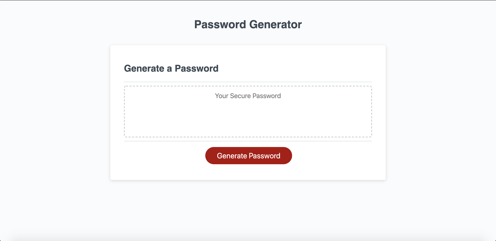
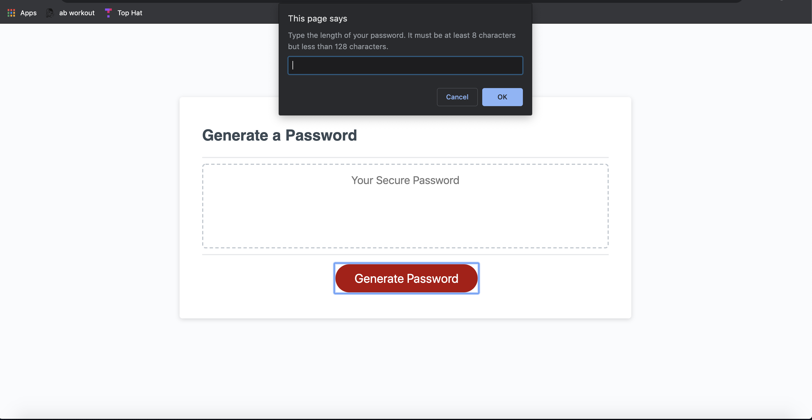
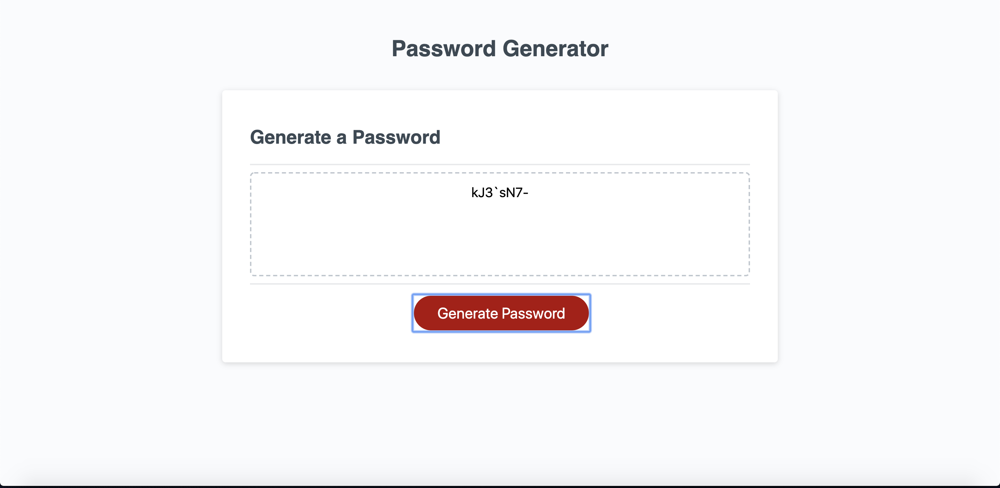

# Project Description
The goal of this project is to use javascript to interact with a user to generate a password fit for their criteria. The application uses pop up windows to gather the user's criteria and then generates a password which is printed to the screen. The user will choose how long their password will be, if there are lowercase characters, if there are uppercase characters, if there are numeric characters, and/or if there are special characters. 

# What the Website Looks Like
The first image is what the site looks like upon loading. The second image is what the site looks like once the user clicks on the "Generate Password" button. The third image is what the site looks like once a password has been generated. 

# Link to Deployed Application
Link: https://anishasnet.github.io/password-generator/
